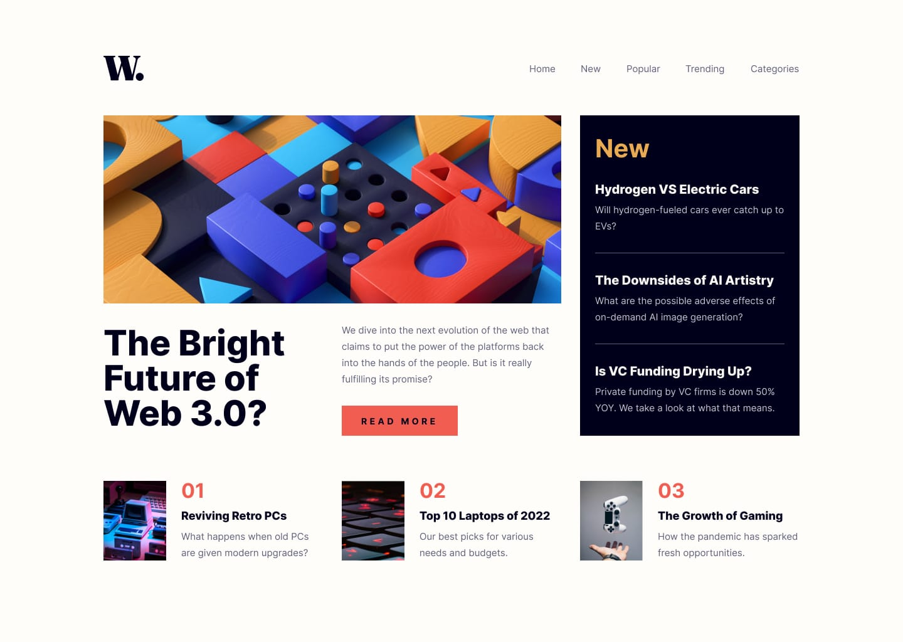

# Frontend Mentor - News homepage
<h1 align="center"> HomePage </h1>

"Esta é uma solução para o desafio da página inicial de notícias no Frontend Mentor"(https://www.frontendmentor.io/challenges/news-homepage-H6SWTa1MFl).
  

 <a href="#-desafios">Desafios</a>&nbsp;&nbsp;&nbsp;|&nbsp;&nbsp;&nbsp;
  <a href="#-tecnologias">Tecnologias</a>&nbsp;&nbsp;&nbsp;|&nbsp;&nbsp;&nbsp;
  <a href="#-projeto">Projeto</a>&nbsp;&nbsp;&nbsp;|&nbsp;&nbsp;&nbsp;
  <a href="#-layout">Layout</a>&nbsp;&nbsp;&nbsp;|&nbsp;&nbsp;&nbsp;
  <a href="#memo-licença">Licença</a>

  

 

  

## 🏆 Desafios

"Os usuários devem ser capazes de:

- Ver o layout ideal para a interface, dependendo do tamanho da tela de seu dispositivo
- Ver os estados de hover (passar o cursor sobre) e focus (foco) para todos os elementos interativos na página"

## 🚀 Tecnologias

Esse projeto foi desenvolvido com as seguintes tecnologias:

- HTML e CSS
- JavaScript
- Git e Github

## 💻 Projeto

O projeto do Home Page tem como objetivo facilitar a navegação para outras seções do site ou aplicativo, fornecendo links claros e bem-organizados.

<!-- - [Acesse o projeto finalizado, online](https://alessandropfreitas.github.io/DevLinks/) -->

## :memo: Licença

Esse projeto está sob a licença MIT.